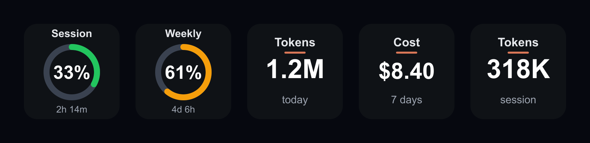

# Claude Usage — Stream Deck plugin

Stream Deck keys that show your **live Claude usage limits** and your **local
token / cost totals**. One configurable action — drop it on as many keys as you
like and pick a metric per key. Tap any key to force a refresh.




---

## Contents

- [What it shows](#what-it-shows)
- [Requirements](#requirements)
- [Install](#install)
- [Configure](#configure)
- [Verify the data layer first (optional but handy)](#verify-the-data-layer-first-optional-but-handy)
  - [macOS](#macos)
  - [Linux](#linux)
- [Notes & gotchas](#notes--gotchas)
- [Rebuild from source](#rebuild-from-source)
- [Project structure](#project-structure)
- [License](#license)

---

## What it shows

Place the action on several keys, each set to a different metric, to see them all
at once. Two families:

| Metric | Family | Source | Shown as |
| --- | --- | --- | --- |
| **Session (5h)** | Limit (live) | `oauth/usage` endpoint (same as Claude Code's `/usage`) | big % + ring gauge + reset countdown |
| **Weekly (7d)** | Limit (live) | same endpoint | big % + ring gauge + reset countdown |
| **Weekly Opus** | Limit (live) | same endpoint | big % (or `--` if your plan doesn't report it) |
| **Weekly Sonnet** | Limit (live) | same endpoint | big % (or `--`) |
| **Tokens** | Local logs | Claude Code JSONL transcripts on disk | big value (e.g. `1.2M`) + `today` / `7 days` / `session` |
| **Cost** | Local logs | Claude Code JSONL transcripts on disk | big value (e.g. `$8.40`) + `today` / `7 days` / `session` |

Live limits are color-coded green → amber → red. Updates run every 60s, and
**tapping any key forces a refresh now**.

## Requirements

**To run:** the official [Elgato Stream Deck app](https://www.elgato.com/downloads)
**6.9 or newer** — it ships the Node runtime the plugin uses, so you do **not**
need Node.js installed separately. Runs on **Windows 10+** and **macOS 12+**, and
on both **Pro and Max** (metrics a plan doesn't report show `--`).

> **Log in to Claude Code at least once** on this machine first, so the token
> exists. The plugin reads it from `%USERPROFILE%\.claude\.credentials.json` on
> Windows, or the **login Keychain** (`Claude Code-credentials`) on macOS, and
> never sends it anywhere except Anthropic's own usage endpoint. Token/cost
> metrics additionally read the local transcripts under `~/.claude/projects/`.

> **Linux:** not supported for running. There is no official Stream Deck app for
> Linux, so the `.streamDeckPlugin` can't be installed there — but the data layer
> is plain Node and works on Linux (token from `~/.claude/.credentials.json`,
> logs from `~/.claude/projects/`), so the verify command below and the source
> build both run fine on Linux.

**To build from source:** [Node.js 20+](https://nodejs.org) (any OS).

## Install

1. **Stream Deck app 6.9+** installed (see [Requirements](#requirements)).
2. Double-click **`com.saeedkolivand.claude-usage.streamDeckPlugin`** and click **Install**.
3. In Stream Deck, open the **Claude Usage** category in the actions list and drag
   **Claude Usage** onto a key.
4. Select the key and pick a **Metric** in its settings (see [Configure](#configure)).
   Repeat on more keys for the others.

That's it. Keys populate within a second or two of being placed.

## Configure

Select the key, then open its property inspector (panel below the canvas):

| Field | What it does |
| --- | --- |
| **Metric** | Which value the key shows: Session / Weekly / Weekly Opus / Weekly Sonnet (live limits), or Tokens / Cost for today / 7 days / session. |
| **Amber threshold** | % where a live limit gauge turns amber (default `50`). |
| **Red threshold** | % where a live limit gauge turns red (default `80`). |
| **User-Agent** (Advanced) | Sent to the usage endpoint; must start with `claude-code/` (default `claude-code/2.0.31`). Bump it if Anthropic ever tightens the check. |

## Verify the data layer first (optional but handy)

Before (or instead of) debugging the plugin, confirm the endpoint works for your
account. Paste this into **PowerShell**:

```powershell
$cred  = Get-Content "$env:USERPROFILE\.claude\.credentials.json" -Raw | ConvertFrom-Json
$token = $cred.claudeAiOauth.accessToken
Invoke-RestMethod -Uri "https://api.anthropic.com/api/oauth/usage" -Headers @{
  "Authorization"  = "Bearer $token"
  "anthropic-beta" = "oauth-2025-04-20"
  "User-Agent"     = "claude-code/2.0.31"
} | ConvertTo-Json -Depth 5
```

You should get JSON like:

```json
{
  "five_hour":       { "utilization": 33.0, "resets_at": "2026-..." },
  "seven_day":       { "utilization": 13.0, "resets_at": "2026-..." },
  "seven_day_opus":  { "utilization": 12.0, "resets_at": "2026-..." },
  "seven_day_sonnet":{ "utilization": 1.0,  "resets_at": "2026-..." }
}
```

`utilization` is the percentage each key shows. On some plans `seven_day_opus`
(or others) come back `null` — those keys will display `--`, which is expected.

### macOS

The equivalent test (token comes from the Keychain):

```bash
TOKEN=$(security find-generic-password -s "Claude Code-credentials" -w | python3 -c 'import sys,json;print(json.load(sys.stdin)["claudeAiOauth"]["accessToken"])')
curl -s https://api.anthropic.com/api/oauth/usage \
  -H "Authorization: Bearer $TOKEN" \
  -H "anthropic-beta: oauth-2025-04-20" \
  -H "User-Agent: claude-code/2.0.31" | python3 -m json.tool
```

### Linux

Token comes from the file, same as Windows:

```bash
TOKEN=$(python3 -c 'import json,os;print(json.load(open(os.path.expanduser("~/.claude/.credentials.json")))["claudeAiOauth"]["accessToken"])')
curl -s https://api.anthropic.com/api/oauth/usage \
  -H "Authorization: Bearer $TOKEN" \
  -H "anthropic-beta: oauth-2025-04-20" \
  -H "User-Agent: claude-code/2.0.31" | python3 -m json.tool
```

## Notes & gotchas

- **Unofficial endpoint.** `api.anthropic.com/api/oauth/usage` is undocumented and
  community-discovered. It could change or disappear without notice. If it does,
  keys show `offline`/`--` and keep the last good value — nothing breaks.
- **The `User-Agent` matters.** It must start with `claude-code/`. Without it the
  endpoint serves an aggressively rate-limited bucket (constant 429s). The plugin
  sends `claude-code/2.0.31` by default; if Anthropic ever tightens the check,
  bump the version string in the key's **Advanced → User-Agent** field.
- **Token refresh.** Claude Code refreshes the token in `.credentials.json`
  automatically while you use it. If the plugin shows `open Claude`, just launch
  Claude Code once to refresh, and the keys recover on the next tick.
- **One network call, not four.** All your Claude Usage keys share a single
  cached fetch per minute, so adding more keys doesn't multiply API calls.
- **Pro vs Max.** Works on both. Max reports the Opus/Sonnet weekly breakdowns;
  Pro may not, in which case those keys read `--`.
- **macOS.** Supported. The token is read from the login Keychain
  (`security find-generic-password -s "Claude Code-credentials"`), and the
  transcripts from `~/.claude/projects/`. If a key shows `open Claude`, macOS may
  be prompting for Keychain access — approve it (or run Claude Code once).
- **Tokens & cost are best-effort.** They're parsed from Claude Code's local
  JSONL logs, which have two known quirks:
  - Claude Code currently under-records `input`/`output` tokens in the logs
    (cache tokens are accurate), so token totals lean low and pure-compute cost
    is a **lower bound**. To minimize this, cost prefers the per-message `costUSD`
    Claude Code writes and only computes from tokens when that's missing.
  - On **Pro/Max you don't pay per token** — the cost shown is *notional
    "equivalent API spend"*, useful for relative sense, not a real charge.
  - "Session" = your most-recently-active Claude Code conversation; "today" is by
    local calendar day. Entries are de-duplicated by request id.
  - **Model pricing is version-proof.** The model is read per message from your
    own logs (`message.model`) and reduced to a family — `opus`, `sonnet`, or
    `haiku` — not a hardcoded model id, so new releases (e.g. a future
    `opus-4-9`) map to the right rate automatically. Only the per-family rates in
    `PRICING` (`src/usage-core.ts`) need editing if Anthropic changes prices; an
    unrecognized family falls back to Sonnet-class pricing.

## Rebuild from source

The source is included so you can tweak colors, labels, thresholds, or layout.

```bash
npm install
npm run build      # bundles src/plugin.ts -> com.saeedkolivand.claude-usage.sdPlugin/bin/plugin.js
npm run preview    # regenerate docs/preview.png (README banner) from the real key faces
npx streamdeck validate com.saeedkolivand.claude-usage.sdPlugin
npx streamdeck pack com.saeedkolivand.claude-usage.sdPlugin --output dist --force
python3 make_icons.py   # only if you change the icon art
```

To tweak the gauge look edit `svgKey`, the token/cost tiles edit `svgStat`, the
metric definitions edit `METRICS` / the `LOG_METRICS` set in `plugin.ts`, and the
cost fallback rates edit `PRICING` — all in `src/usage-core.ts`.

The build commands above are identical on Windows (PowerShell), macOS, and Linux
— only `make_icons.py` needs Python with Pillow (`pip install pillow`).

## Project structure

```
src/usage-core.ts   token read (file + macOS Keychain), API fetch (cached),
                    metric/threshold logic, JSONL token/cost parser, SVG renderers
src/plugin.ts       Stream Deck wiring (action, 60s refresh loop, force-on-press)
scripts/
  make-preview.ts   renders docs/preview.png (README banner) from the real key faces
com.saeedkolivand.claude-usage.sdPlugin/
  manifest.json     plugin + action definition (Node 20 runtime, Windows + macOS)
  bin/plugin.js     bundled output (regenerated by `npm run build`)
  ui/inspector.html settings panel (metric, thresholds, User-Agent)
  imgs/             icons
docs/
  preview.png       readme banner (generated by `npm run preview`)
```

## License

MIT.
